<div style="background-color: #C7EDCC;">
&nbsp;
&nbsp;
<div style="text-align: center;">

<font size=10 color=black face="Comic Sans MS">🔥<mark>CHIVII</mark>🔥</font>

# [User Manual / 用户手册]
</div>
<div style="margin: 0 auto; text-align: left; width: 60%;">

<p align="center"> <a></a> </p>

## <table><tr><td bgcolor=#000000><font color=cyan>📘 **Introduction / 简介**</font></td></tr></table>

Welcome to the CHIVII User Manual. This document will guide you through the setup, usage, and optimization of the CHIVII software.

欢迎使用 CHIVII 用户手册。本手册将引导您完成 CHIVII 软件的安装、使用和优化。

&nbsp;
## <table><tr><td bgcolor=#000000><font color=cyan>📋 **Table of Contents / 目录**</font></td></tr></table>

1. [⚙️ Environment Setup / 环境设置](#environment-setup)
2. [🖥️ Software GUI Explanation / 软件界面说明](#software-gui-explanation)
3. [📘 How to Use / 如何使用](#how-to-use)
4. [🌟 How to Help Improve / 如何改进软件](#how-to-help-improving)

&nbsp;
## <table><tr><td bgcolor=#000000><font color=cyan>⚙️ **Environment Setup / 环境设置**</font></td></tr></table>

### <font color=blue>System Requirements / 系统要求</font>

- To use CHIVII, ensure your system meets the following requirements:
    - Operating System: Windows 10 or higher
    - Graphics Card: Discrete GPU with performance equivalent to or better than GTX 970
    - C++ Runtime: Download and install or update from either [GitHub](https://github.com/abbodi1406/vcredist/releases) or [GHXI](https://www.ghxi.com/visualcppredist.html)
    - NVIDIA Driver Version: <mark>[537.58](https://www.nvidia.com/download/driverResults.aspx/212701/en-us/)</mark> (for compatibility)
    - AMD Driver Version: Lastest stable version

- 为了使用 CHIVII，请确保您的系统满足以下要求：
    - 操作系统：Windows 10 或更高版本
    - 显卡：独立 GPU，性能等同或优于 GTX 970
    - C++ 运行库：从 [GitHub](https://github.com/abbodi1406/vcredist/releases) 或 [GHXI](https://www.ghxi.com/visualcppredist.html) 下载并安装/更新
    - NVIDIA 驱动版本：<mark>[537.58](https://www.nvidia.com/download/driverResults.aspx/212701/zh-cn/)</mark>（为了兼容性）
    - AMD 驱动版本: 最新稳定版

### <font color=blue>System Repair Commands / 系统修复命令</font>

- If you encounter any issues with your system, first run the following commands/scripts **AS ADMINISTRATOR** to help fix them:

- 如果您遇到任何系统问题，请首先使用以**管理员权限**运行以下命令/脚本来帮助解决：

```
REM System repair / 系统修复
sfc /scannow
DISM.exe /Online /Cleanup-Image /RestoreHealth
```
```
REM Network reset / 网络重置
netsh winsock reset
netsh int ip reset
netsh winhttp reset proxy
ipconfig /release
ipconfig /renew
ipconfig /flushdns
ipconfig /registerdns
```

&nbsp;
## <table><tr><td bgcolor=#000000><font color=cyan>🖥️ **Software GUI Explanation / 软件界面说明**</font></td></tr></table>

- In this section, we will explain the usage of each widget within the software. Refer to the provided images for detailed explanations. Click to show image.

- 在本部分中，我们将解释软件中每个小部件的使用。请参阅提供的图像以获得详细说明。点击对应文字以显示图像。
<div style="text-align: left; margin-left: 5%; margin-right: 5%;">
<details>
<summary>Main / 主界面</summary>

- Preview of basic info / 基本信息概览

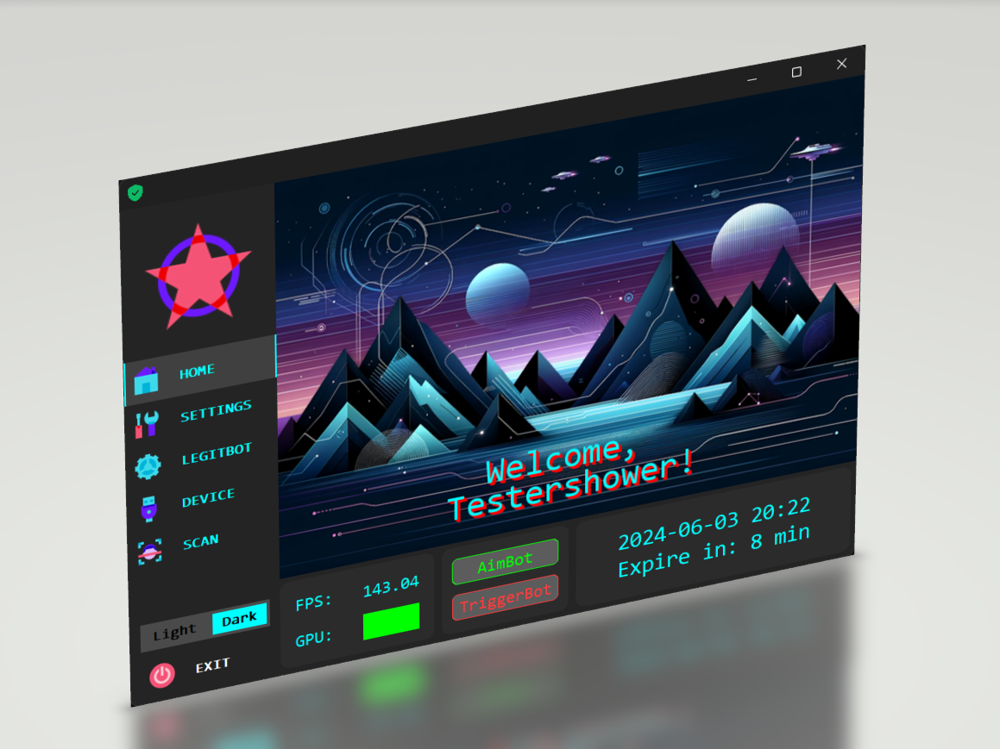
</details>

<details>
<summary>Settings / 设置界面</summary>

- GUI and misc settings / 图形界面以及额外设置
- Shortcuts to Legitbot settings / 跳转到机器人设置的快捷方式
- Switch settings for different games / 为不同游戏切换不同个性化设置

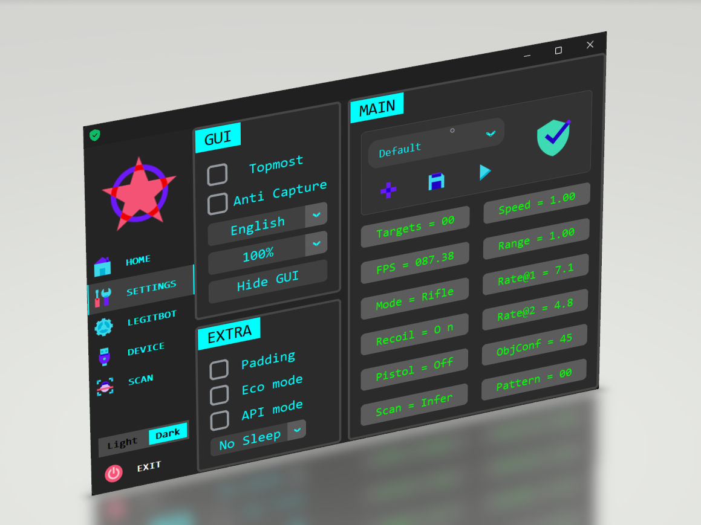
</details>

<details>
<summary>LegitBot / 合法机器人</summary>

- Aimbot+Triggerbot / 智能辅助瞄准与智能辅助扳机
- Free and personalized configuration / 自由且个性化配置

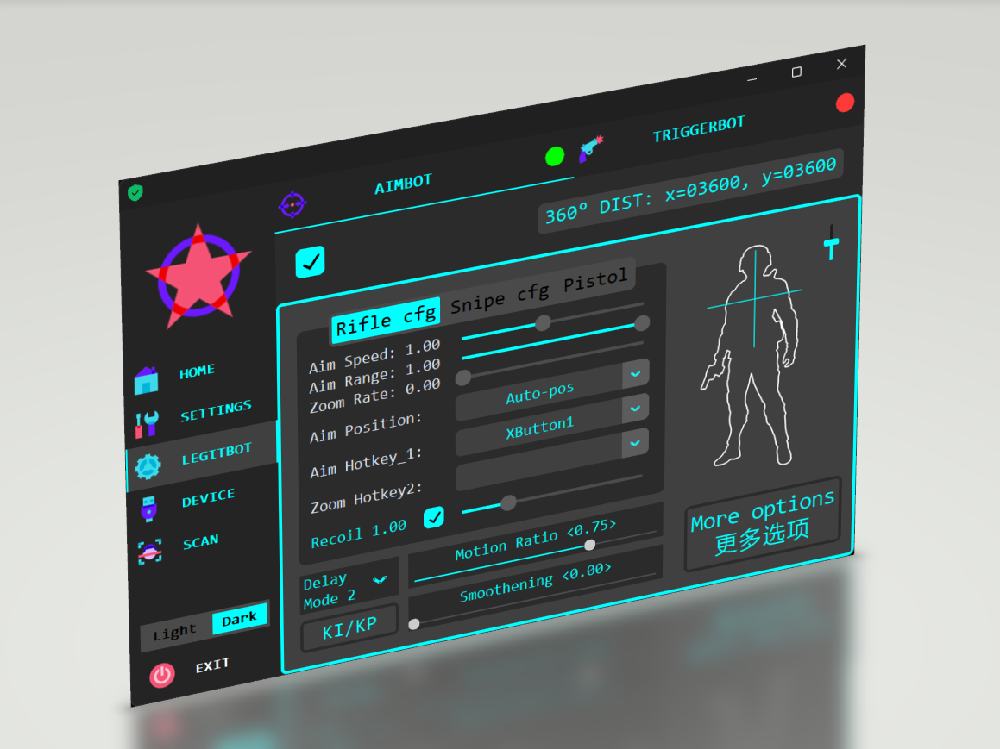
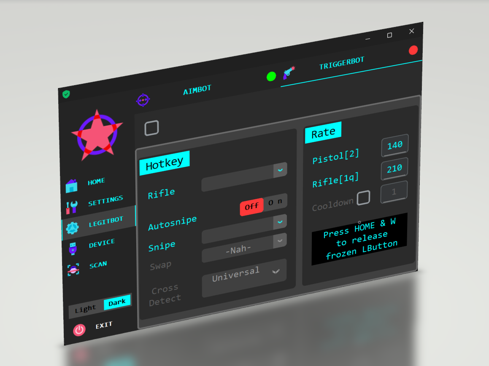
</details>

<details>
<summary>Devices / 设备界面</summary>

- 8 different simulation methods / 8种不同的键鼠模拟方式
- 3 different image transmission methods / 3种不同的图像传输方式

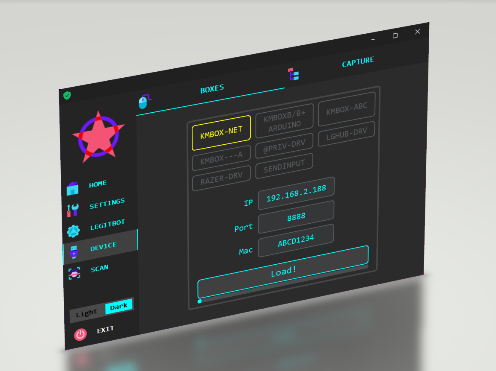

</details>

<details>
<summary>Image Processing / 图像处理界面</summary>

- Highly customizable colorbot / 高度可定制化颜色机器人

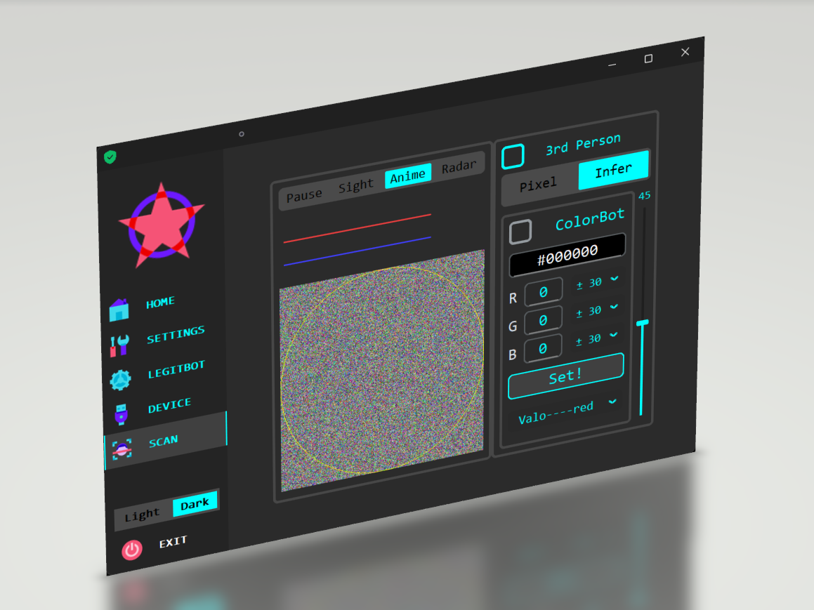
</details>
</div>
&nbsp;

## <table><tr><td bgcolor=#000000><font color=cyan>📘 **How to Use / 如何使用**</font></td></tr></table>

This section explains how to use and configure the settings as well as what each setting represents.

本部分将解释如何使用并进行妥善设置以及每个设置的含义。

### <font color=blue>Starting with a Configuration / 从选择配置开始</font>

You can either select an existing configuration option or start with the default settings.

您可以选择自己保存的配置选项或从默认设置开始。
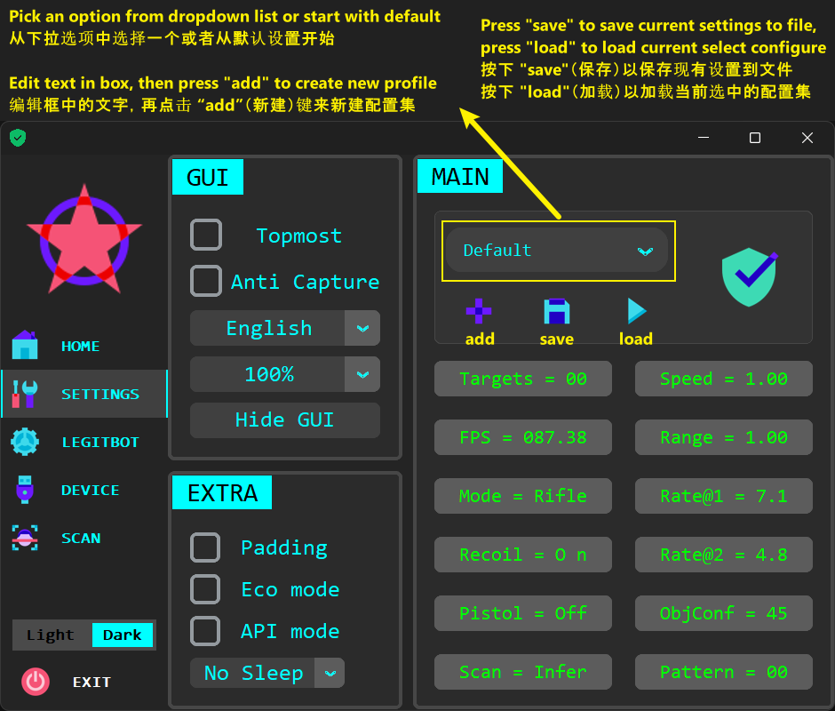
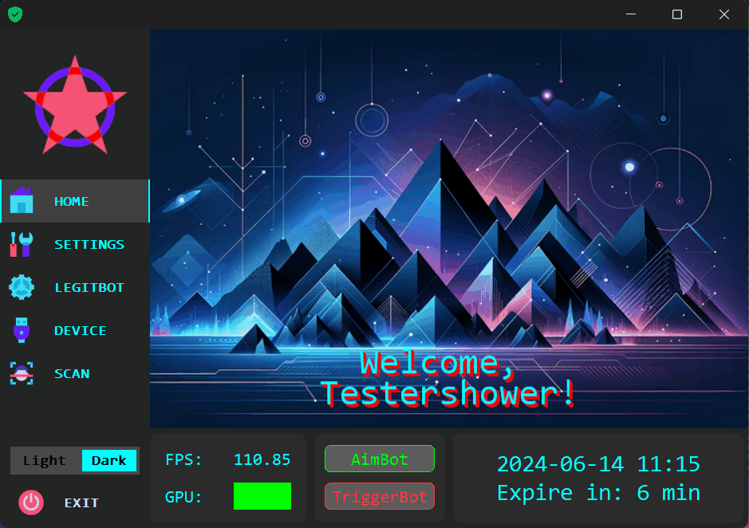

### <font color=blue>Testing 360° Distance / 测试 360° 距离</font>

1. Enter a bot or training room in the game.
2. Find an isolated enemy who is sufficiently distant to appear small in the game window.
3. Press the hotkeys <mark>Home+Backspace</mark> to start the test automatically.

**This data serves as the basis for accurate movement**

1. 进入游戏中的机器人房间或训练场。
2. 找到一个足够远的孤立敌人，使其在游戏窗口中显得较小。
3. 按下热键<mark> Home+Backspace </mark>自动开始测试。

**此数据是精确移动的基础**


### <font color=blue>Single PC Usage / 单台电脑使用</font>

- ~~Pick a simulation method~~(A usable simulation method has been automatically loaded already, modify only if you know what you are doing and feel necessary)
- ~~选择一个键鼠模拟~~(程序运行时已经自动加载了一个可用的键鼠模拟方式，如非必要无需调整，除非你了解相关方式)

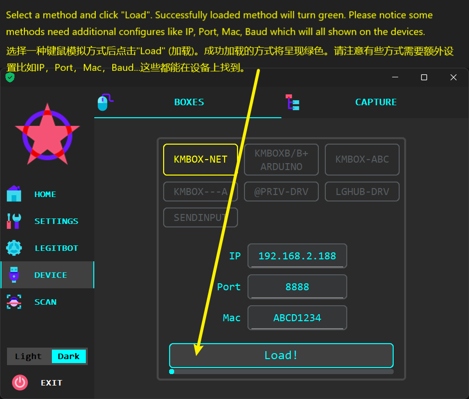

- Adjust cursor move speed properly for aimbot.
- 妥善调整辅助瞄准中指针的移动速率。

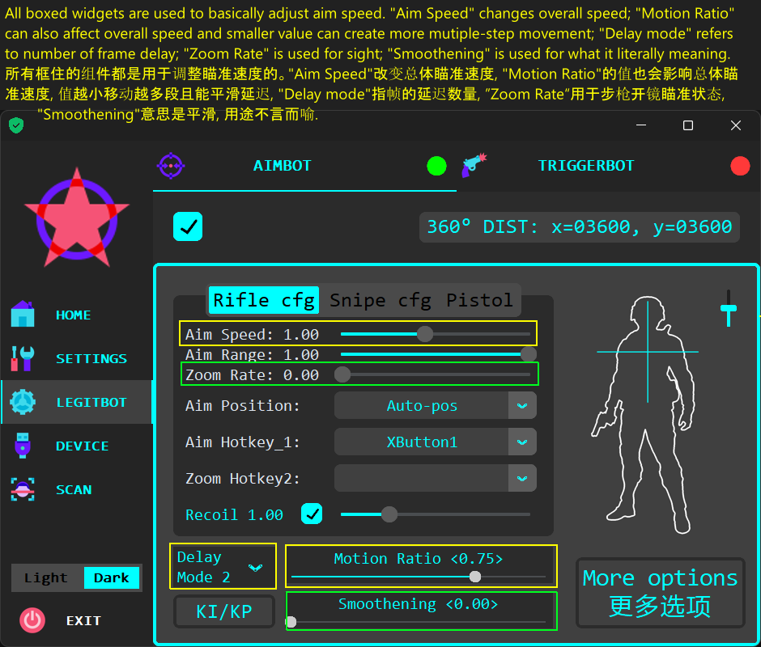

- Configure triggerbot settings
- 调整扳机配置

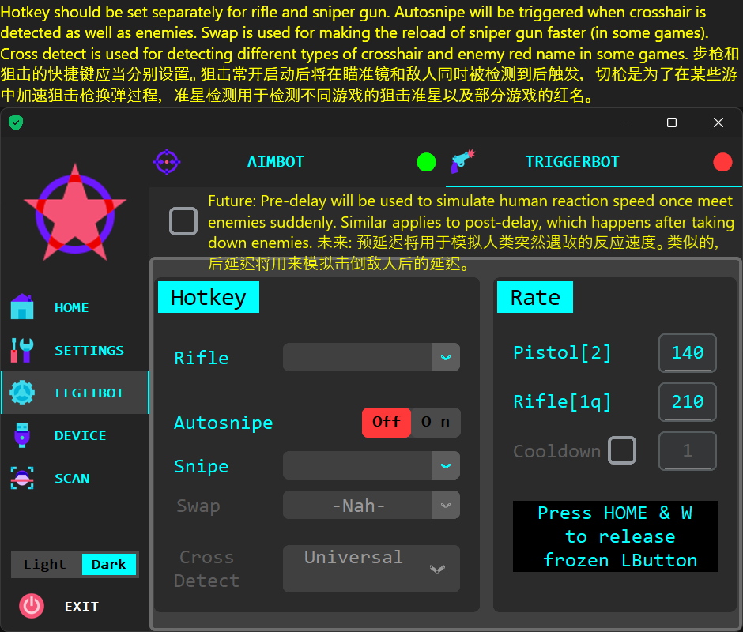

### <font color=blue>Dual PC Usage / 双机使用</font>

Dual PC usage includes the same content as single PC usage, except for the method of obtaining frames from another PC. Methods include LAN connection or using capture card.

双台电脑使用与单台电脑使用的内容相同，但获取另一个电脑的帧的方法除外。方法包括局域网连接或使用采集卡。

1. LAN / 局域网
    - On first PC, copy compiled plugin (dlls) to folder location of correspond software and replace original file. Those plugins won't influence your daily usage of this software.
    - 在游戏机上将编译好的插件(dll格式)复制到对应软件目录下并替换原有文件。这些插件不会影响软件的日常使用。

    - Currently you got those options: Discord, QQ, WeChat, Huya, Douyin, Douyu, Bilibili and KOOK.
    - 目前有以下几种选项: Discord，QQ，微信，虎牙，抖音，斗鱼，哔哩哔哩直播姬和KOOK。

    - You need to start selected software **as administrator** to make it (LAN) work.
    - 需要**以管理员启动**选择的软件才能正常使用局域网功能。

    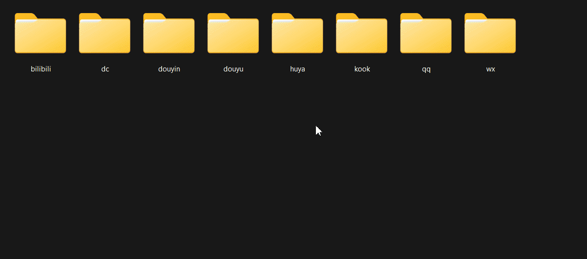

    - Copy IP and Port on popup window and put those in Device -> Capture -> LAN
    - 将IP和Port数值记录并输入到 设备->流采集->LAN

    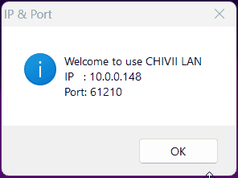

    - Port value will be random value each time. Pressing left control & 8/9/0 and hold for 0.5 second will automatically correct screenshot position on the first PC, pressing left control & 6/7 will pause/resume screenshots.
    - Port的值每次都是随机生成。同时按住左Ctrl键以及8/9/0等数字键0.5秒钟会自动修正截图位置，同时按住左Ctrl键以及6/7等数字键会暂停/恢复截图。

    - Click "SET!" at Device -> Capture -> LAN to finalize the connection.
    - 在界面 设备->流采集->LAN 点击 "设置!" 以完成连接。

    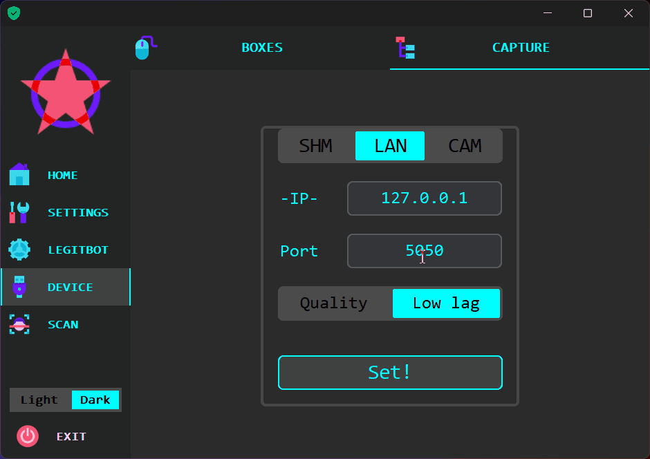


2. Capture card / 采集卡
    - Go to Device -> Capture -> CAM and select one that has actual video shows at Scan frame.
    - 导航至 设备->流采集->CAM 后选择一个能使得扫描界面正常出画面的选项。

    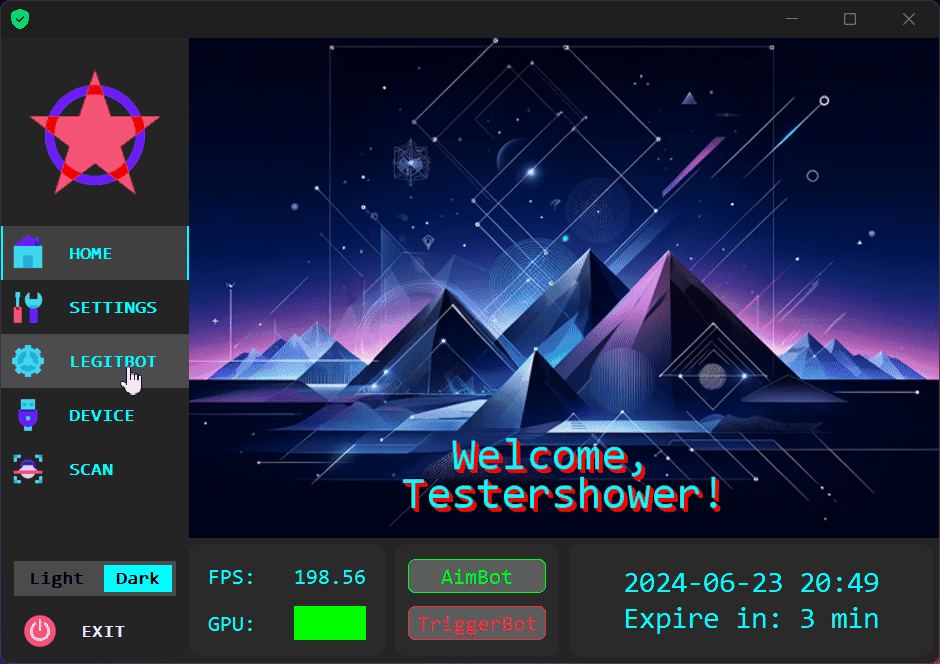

&nbsp;
## <table><tr><td bgcolor=#000000><font color=cyan>🌟 **How to Help Improving / 如何帮助改进软件**</font></td></tr></table>

Learn how you can contribute to the improvement of this software.

了解您如何为改进该软件做出贡献。

- Report to your agent about bugs and wishing features.
- 向您的代理报告软件漏洞以及期待的新功能。

- Take screenshot and upload undetect targets.
- 截图并上传未能检测到的敌方目标。

- Join the Annotation Team.
- 加入标注团队。

</div>
&nbsp;
&nbsp;
</div>
